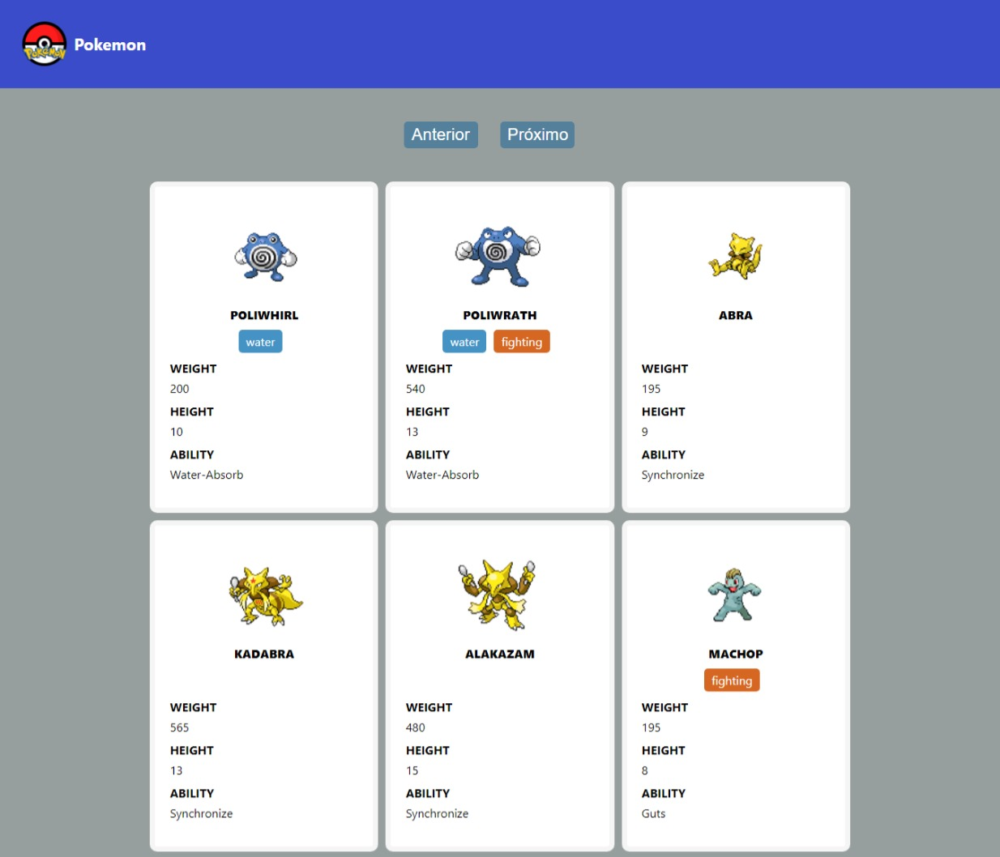

# Pokemon API

<h1 align="center">
    
</h1>

<ol>
    <li><a href="#sobre">Sobre</a></li>
         <->
        <>   </>
        <li> <a href="#resultados"> Resultados de Desenvolvimento</a> </li>
       
</ol>

<h2 id="sobre">Sobre</h2> 

Este projeto apresenta o consumo da  [PokéApi v2](https://pokeapi.co/docs/v2) usando ReactJs.
 

<h2 id="resultados">Resultados de Desenvolvimento</h2> 

<h3 align="center">
    
</h3>

* Como a aplicação é de nível iniciante, ela é simples, mas está voltada para o uso de alguns conceitos base para o consumo de uma API em React. Como por exemplo, o uso de `useState` e `useEffect`.

 
  [LinkedIn - Dionísio Braga](https://www.linkedin.com/in/dion%C3%ADsio-braga/) 
 

# Pokemon API

<h1 align="center">
    
</h1>

<ol>
    <li><a href="#sobre">Sobre</a></li>
         <->
        <>   </>
        <li> <a href="#resultados"> Resultados de Desenvolvimento</a> </li>
       
</ol>

<h2 id="sobre">Sobre</h2> 

Este projeto apresenta o consumo da  [PokéApi v2](https://pokeapi.co/docs/v2) usando ReactJs.
 

<h2 id="resultados">Resultados de Desenvolvimento</h2> 

<h3 align="center">
    
</h3>

* Como a aplicação é de nível iniciante, ela é simples, mas está voltada para o uso de alguns conceitos base para o consumo de uma API em React. Como por exemplo, o uso de `useState` e `useEffect`.

 
  [LinkedIn - Dionísio Braga](https://www.linkedin.com/in/dion%C3%ADsio-braga/) 
 
